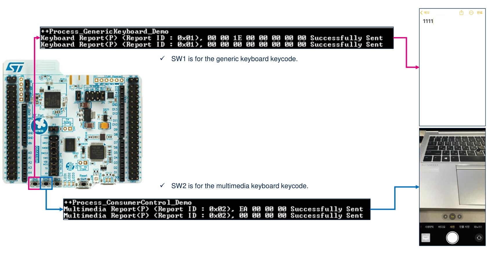

# STM32WB BLE HID Selfie

## Overview

This application is designed to help you send keycodes for both generic and multimedia keyboards to your device. It's a great starting point if you're looking to make any BLE Human Interface Device (HID). One cool feature here is that you can use the volume down keycode as a shortcut for taking a selfie.

### Keywords

Connectivity, STM32, P-NUCLEO-WB55, BLE, HID

## Requirements

* This application runs on a [NUCLEO-WB55RG](https://www.st.com/en/evaluation-tools/nucleo-wb55rg.html).
* This application requires having the stm32wb5x_BLE_Stack_full_fw.bin binary flashed on the Wireless Coprocessor.

## How to use

In order to make the program work, you must do the following :

* Open your toolchain
  * This example was prepared using STM32CubeIDE v1.9.0
* Rebuild all files and flash the board with the executable file
  * Please confirm "ST_SELFIE" define in your project (enabled by default)

On the Android/iOS device, enable the Bluetooth communications, and if not done before :

* Open bluetooth settings, and start scanning
* Connect to ST_HID device and click "yes" if devcie ask to do the pairing
* Push SW1 to send number "1" keycode
* Push SW2 to send volume down keycode
* A display terminal can be used to display application messages

 

## Troubleshooting

**Caution** : Issues and the pull-requests are **not supported** to submit problems or suggestions related to the software delivered in this repository. The STM32WB-BLE-Hid-Selfie example is being delivered as-is, and not necessarily supported by ST.

**For any other question** related to the product, the hardware performance or characteristics, the tools, the environment, you can submit it to the **ST Community** on the STM32 MCUs related [page](https://community.st.com/s/topic/0TO0X000000BSqSWAW/stm32-mcus).